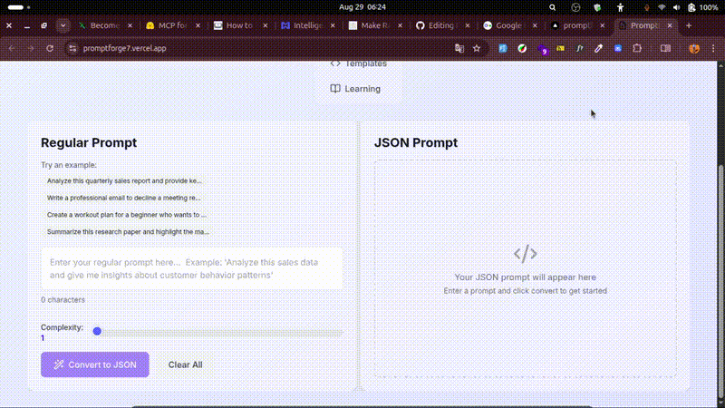

# PromptForge7


> **Transform regular prompts into powerful structured JSON prompts that get better AI results.**

PromptForge7 is a web application that leverages Google's Gemini AI to convert natural language prompts into structured JSON formats, making your AI interactions more precise, consistent, and effective.




## Features

- **AI-Powered Conversion**: Smart transformation using Google Gemini 2.0.
- **Template Library**: Pre-built templates for common use cases.
- **Modern UI**: A responsive design with smooth animations.
- **Copy & Export**: Easy sharing and downloading of JSON prompts.
- **Learning Center**: A comprehensive guide to JSON prompting best practices.
- **Real-time Processing**: Fast conversions with detailed explanations.
- **Template Search**: Find the perfect template quickly.
- **Editable JSON**: Edit the generated JSON directly in the UI.
- **Complexity Control**: Adjust the complexity of the generated JSON with a simple slider.

## Quick Start

### Prerequisites

- Node.js 18+
- npm or yarn
- Google Gemini API key ([Get yours here](https://makersuite.google.com/app/apikey))

### Installation

```bash
# Clone the repository
git clone https://github.com/yourusername/promptforge.git
cd promptforge

# Install dependencies
npm install

# Set up environment variables
cp .env.example .env.local
# Edit .env.local and add your Gemini API key

# Start development server
npm run dev
```

Open [http://localhost:3000](http://localhost:3000) to see your application.

### Environment Setup

Create a `.env.local` file in your project root:

```env
GEMINI_API_KEY=your_gemini_api_key_here
```

## Tech Stack

- **Framework**: Next.js 14 with App Router
- **Language**: TypeScript
- **Styling**: Tailwind CSS
- **AI**: Google Gemini 2.0 Flash
- **Syntax Highlighting**: Prism.js via react-syntax-highlighter
- **Icons**: Lucide React
- **Deployment**: Netlify (recommended) or Vercel

## Project Structure

```
promptforge/
├── src/
│   ├── app/
│   │   ├── globals.css         # Global styles
│   │   ├── layout.tsx          # Root layout
│   │   └── page.tsx            # Main application
│   ├── lib/
│   │   ├── gemini.ts           # Gemini AI integration
│   │   └── templates.ts        # Prompt templates
│   └── types/
│       └── index.ts            # TypeScript definitions
├── public/                     # Static assets
├── .env.local                  # Environment variables
├── next.config.js              # Next.js configuration
deployment config
└── tailwind.config.js         # Tailwind CSS config
```

## Usage

### Converting Prompts

1.  **Enter Your Prompt**: Type or paste your natural language prompt.
2.  **Adjust Complexity**: Use the slider to set the desired complexity of the JSON output.
3.  **Click Convert**: Let AI transform it into structured JSON.
4.  **Review & Edit**: Review the generated JSON and edit it directly if needed.
5.  **Export**: Copy or download the generated JSON prompt.
6.  **Learn**: Read the explanation to understand the improvements.

### Using Templates

1.  **Browse Categories**: Explore templates by Analysis, Creative, Development, etc.
2.  **Search**: Use the search bar to find specific templates.
3.  **Preview Structure**: Expand templates to see the JSON structure.
4.  **Apply**: Click "Use Template" to load the structure into the converter.
