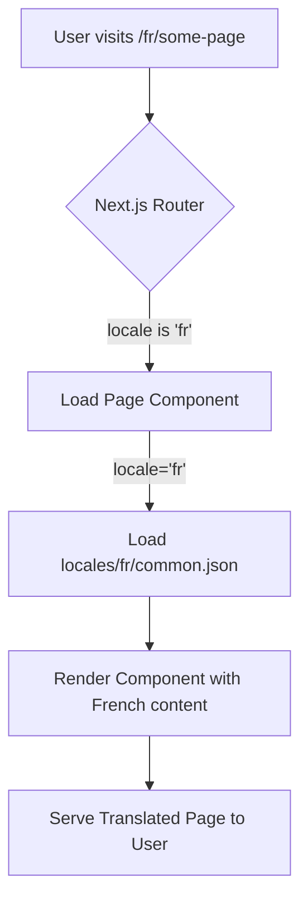

# Internationalization (i18n) Plan & Guide

This document outlines a simple and efficient strategy for adding internationalization to the Y7-Jprompter application, leveraging the built-in capabilities of Next.js.

## 1. Strategy Overview

We will use Next.js's built-in Internationalized Routing, which handles locale detection and routing automatically. This approach is efficient and requires no external dependencies.

- **Routing:** Use sub-path routing (e.g., `/fr/about`, `/es/about`).
- **Translation Management:** Store translation strings in JSON files for each locale (e.g., `locales/en/common.json`, `locales/fr/common.json`).
- **Component Integration:** Use a hook to load the appropriate translations within components.

## 2. Implementation Steps

Here is a step-by-step guide to implement i18n.

### Step 1: Configure Next.js for i18n

Modify [`next.config.js`](./next.config.js) to define the supported locales and the default locale.

```javascript
/** @type {import('next').NextConfig} */
const nextConfig = {
  i18n: {
    locales: ['en', 'fr', 'es'], // Add the languages you want to support
    defaultLocale: 'en',
  },
};

module.exports = nextConfig;
```

### Step 2: Create Locale Dictionaries

Create a `locales` directory in the project root to store the translation files.

```
/
|-- locales/
|   |-- en/
|   |   `-- common.json
|   |-- fr/
|   |   `-- common.json
|   `-- es/
|       `-- common.json
|-- src/
...
```

**Example: `locales/en/common.json`**
```json
{
  "title": "JSON Prompter",
  "description": "Transform regular prompts into powerful structured JSON prompts"
}
```

**Example: `locales/fr/common.json`**
```json
{
  "title": "J-Prompter JSON",
  "description": "Transformez les invites habituelles en invites JSON structurées et puissantes"
}
```

### Step 3: Access Translations in Components

In your pages (e.g., [`src/app/page.tsx`](./src/app/page.tsx:1)), you can get the current locale from the `params` and load the corresponding translation file.

```typescript
// src/app/page.tsx

import { promises as fs } from 'fs';
import path from 'path';

export default async function Home({ params: { locale } }: { params: { locale: string } }) {
  const file = await fs.readFile(path.join(process.cwd(), `locales/${locale}/common.json`), 'utf8');
  const translations = JSON.parse(file);

  return (
    <main>
      <h1>{translations.title}</h1>
      <p>{translations.description}</p>
    </main>
  );
}
```
*Note: For client components, you would fetch the translations in a `useEffect` hook or use a dedicated context provider.*

### Step 4: Create a Language Switcher (Optional but Recommended)

Create a component that allows users to switch between locales.

```tsx
// src/components/LanguageSwitcher.tsx
'use client';

import { usePathname, useRouter } from 'next/navigation';
import Link from 'next/link';

export function LanguageSwitcher() {
  const pathname = usePathname();
  const router = useRouter();

  const handleLocaleChange = (newLocale: string) => {
    // This will redirect to the new locale while preserving the current path
    const newPath = `/${newLocale}${pathname.replace(/^\/(en|fr|es)/, '')}`;
    router.push(newPath);
  };

  return (
    <div>
      <button onClick={() => handleLocaleChange('en')}>English</button>
      <button onClick={() => handleLocaleChange('fr')}>Français</button>
      <button onClick={() => handleLocaleChange('es')}>Español</button>
    </div>
  );
}
```

## 3. Workflow Diagram

This diagram illustrates the internationalization flow from user request to a rendered, translated page.



## 4. Next Steps

1.  **Code Implementation:** A developer will need to implement the changes described above.
2.  **Translation:** The JSON files will need to be populated with translations for all supported languages.